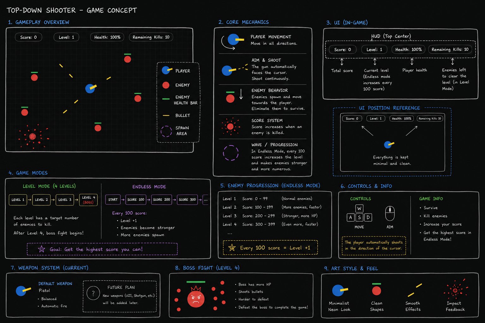

# Top-Down Shooter (Vanilla JS Videogame)

A dynamic, browser-based 2D Top-Down Shooter built using only HTML, CSS, and Vanilla JavaScript. The game features HTML5 Canvas rendering, structured Object-Oriented Programming (OOP) design, dynamic enemy scaling, and persistent high score tracking.

## 🔗 Project Links
*   **Live Game (GitHub Pages):** [https://gurban200ok.github.io/Pixel-Shooter/]
*   **AI Development Log:** [AI_DIARY.md](./AI_DIARY.md)

---

## 📷 Game Design & Visual Layout

Below is the visual layout of the gameplay, showing the player, enemies with active health bars, and the modern UI overlay bar:

 

---

## 🎮 How to Play

### Controls
*   **Move:** Use `W`, `A`, `S`, `D` keys to navigate the player in four directions.
*   **Aim:** Move your `Mouse cursor` around the screen to rotate the player's weapon.
*   **Shoot:** `Left Click` to fire bullets toward your cursor.

### Objectives & Game Modes
When starting the game, you can choose between two main modes:

1.  **Level Mode (4 Stages):**
    *   **Level 1:** Eliminate **10 normal enemies** (Red circles, 1 HP).
    *   **Level 2:** Eliminate **15 fast enemies** (Orange circles, 3 HP).
    *   **Level 3:** Eliminate **20 shooting enemies** (Purple circles, 2 HP) who fire back at you.
    *   **Level 4 (BOSS FIGHT):** Defeat the giant Boss (Purple circle, 50 HP) which unleashes various circular bullet patterns.
2.  **Endless Mode:**
    *   Survive as long as possible. The game counts your score instead of remaining kills.
    *   The difficulty scales progressively every 100 points: enemies get faster, gain more health, start shooting, and eventually transform into giant heavy-shooters firing 3-way split projectiles.

### Win / Lose Conditions
*   **Win Condition (Level Mode):** Successfully defeat the Level 4 Boss to trigger the Victory Screen.
*   **Lose Condition:** Your health drops to **0%** due to contact with enemies or enemy bullets.

---

## 👾 Game Entities

*   **Player (Blue Circle):** Controlled by the user. Has a directional weapon indicator and a 100% health bar.
*   **Normal Enemy (Red Circle):** Standard tracking enemy. Moves straight toward the player.
*   **Fast Enemy (Orange Circle):** High speed, medium health (3 HP) tracking enemy.
*   **Shooter Enemy (Purple Circle):** Slow tracking enemy that shoots single projectiles at the player periodically.
*   **Heavy Shooter (Endless Mode - Dark Blue Circle):** Large-sized tracking enemy that fires a 3-way spreading projectile pattern.
*   **Boss (Level 4 - Giant Purple Circle):** High-health (50 HP) boss with custom multi-directional bullet spray patterns.
*   **Player Bullet (Yellow Circle):** Standard fast projectile fired by the player. Deals 1 damage on impact.
*   **Enemy Bullet (Red/Yellow/Orange Circles):** Projectiles fired by shooting enemies, dealing 10 damage to the player upon impact.

---

## ⚙️ Tech Decisions

*   **Object-Oriented Programming (OOP):** The codebase utilizes ES6 Classes (e.g., `Player`, `Bullet`, `Enemy`) to model active entities. This approach was chosen to manage the state, rendering, and collision updates of multiple independent objects (like dozens of bullets and enemies on screen) in a clean and modular way.
*   **HTML5 Canvas API:** Rather than manipulating dozens of DOM elements (which would cause rendering lag), the entire game logic is drawn on a single `<canvas>` element. This ensures consistent 60 FPS performance and precise coordinate checks.
*   **LocalStorage API:** To persist game milestones, the high score is checked at the end of every session, updated in the browser's local storage, and displayed on both the main menu and game over overlays.
*   **CSS :has Selector & Flexbox:** Used to build a responsive, styled card-selection system without the need for bloated UI libraries or custom radio button wrappers.

---

## 🐛 Known Bugs & Future Improvements

*   **Delta Time Frame Rate Lock:** The game runs inside `requestAnimationFrame`. If the browser tab loses focus, the spawn timers might get slightly desynchronized. Introducing delta-time based movement is planned for future updates.
*   **Weapon Pickups:** The initial game concept included weapon drops (e.g., an automatic Uzi or wide-spread Shotgun). This will be added in future updates to give players more tactical variety.
*   **Particle Effects:** Adding visual particles when enemies explode or bullets hit boundaries to make the gameplay feel more impactful.